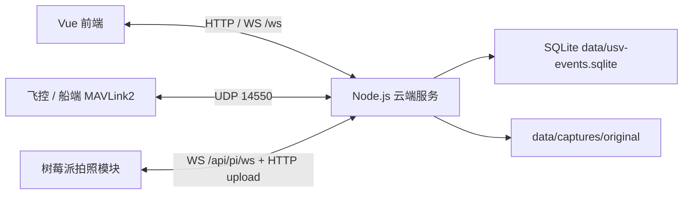

# 系统架构

## 总览

## 后端模块

| 文件 | 职责 |
| --- | --- |
| `server/src/index.ts` | HTTP API、WebSocket、UDP MAVLink、任务/Home/返航/低压/拍照主流程 |
| `server/src/mavlink.ts` | MAVLink2 编解码和常用消息构造 |
| `server/src/state.ts` | 单船状态存储、任务状态 |
| `server/src/types.ts` | 核心类型定义 |
| `server/src/eventLog.ts` | 事件日志和 1 秒遥测采样 SQLite 持久化 |
| `server/src/captureStore.ts` | 拍摄计划、图片元数据、缺图状态 SQLite 持久化 |
| `server/src/simulate-usv.ts` | 本地模拟船端 MAVLink 上报 |

## 前端模块

| 文件 | 职责 |
| --- | --- |
| `client/src/App.vue` | 单页应用主逻辑和视图 |
| `client/src/styles.css` | 全局样式 |
| `client/src/main.ts` | Vue 启动入口 |

当前没有引入 Vue Router，页面切换由 App 内部状态完成。

## 运行时状态

云端当前按单船设计，主要状态保存在内存中：

- 船端在线状态、remote endpoint、遥测、模式、解锁状态。
- 当前任务状态和上传中的 mission item。
- Home 点、Home 同步状态、返航状态。
- 低电压连续计数与自动返航触发锁。
- 当前拍摄任务 `missionId`。

需要持久化的数据写入 SQLite：

- `event_logs`
- `telemetry_samples`
- `capture_plans`
- `capture_images`

## 控制链路

1. 船端通过 UDP 向云端发送 MAVLink2。
2. 云端记录最近 remote endpoint。
3. 前端通过 HTTP 或 WebSocket 请求控制。
4. 云端生成 MAVLink2 控制报文。
5. 云端通过最近 remote endpoint 回发给船端。
6. 飞控 ACK、STATUSTEXT、状态变化写入事件日志并推送前端。

## 航线任务链路

1. 前端编辑航点、等待时间、拍照点、循环次数。
2. 云端生成飞控 mission items。
3. 若设置 Home，任务末尾追加最终 Home 航点。
4. 若航点为拍照点，云端生成 `NAV_WAYPOINT(waitSeconds)` 和 AUX 触发项。
5. 上传成功后保存拍摄计划，并推送给树莓派。
6. 飞控执行任务，不等待云端照片确认。

## Home 与返航

Home 第一版只保存在运行内存中，不持久化。服务重启后需要重新设置。

设置 Home 时，云端会发送 `MAV_CMD_DO_SET_HOME=179` 同步飞控 Home。手动返航和低电压返航使用 RTL，云端监控距离 Home 小于默认 `5m` 后发送 HOLD。

## 低电压保护

后端连续采样电压低于 `21.6V` 达到 5 次后触发自动返航。电压恢复到 `22.0V` 及以上后重置触发锁。

前端持续低电压时显示全屏报警，支持静音和最小化。用户确认后，在断电重连前不重复弹出全屏报警。

## 拍照链路

1. 云端上传任务时生成 `missionId` 和 `capture_plans`。
2. 拍照航点通过 AUX/relay 通知树莓派开始拍照。
3. 树莓派本地缓存照片。
4. 树莓派调用 `/api/captures/upload` 上传原图。
5. 云端按 `expectedPhotoCount` 计算缺失照片。
6. 若缺图，云端通过 `/api/pi/ws` 下发 `capture.reupload`。

